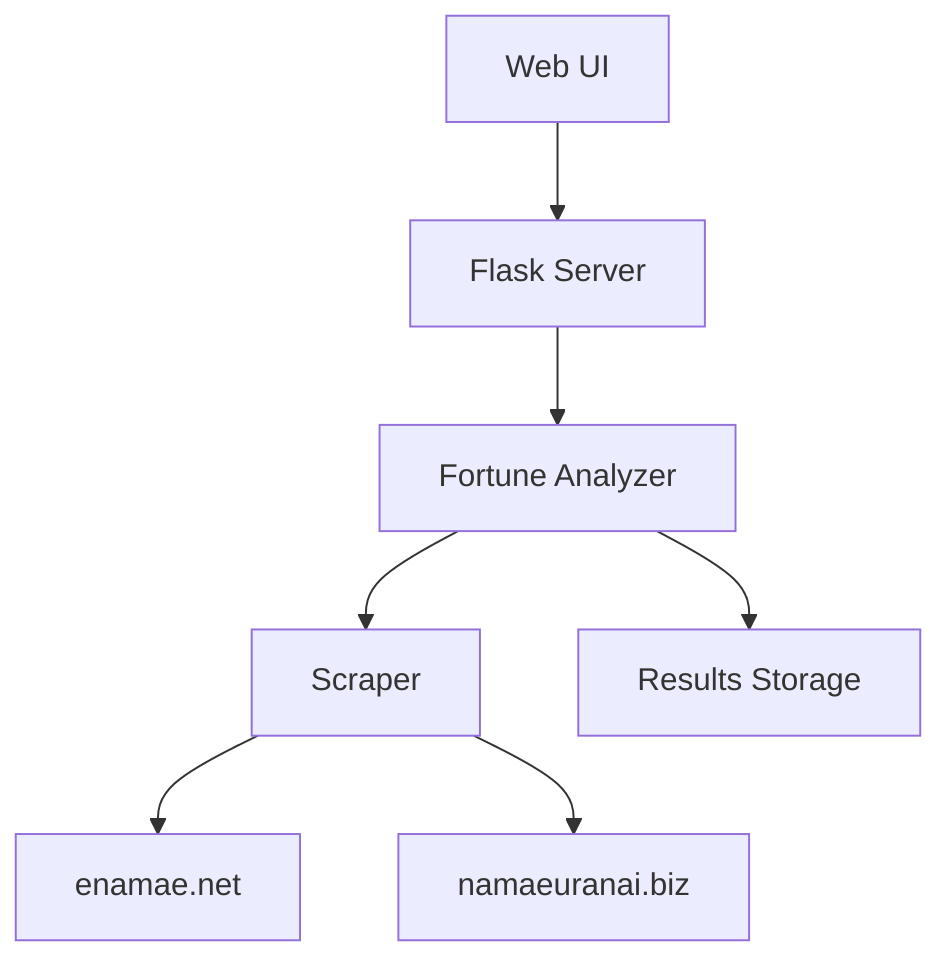

# 姓名判断アプリケーション仕様書

## 1. システム構成

### 1.1 アーキテクチャ


### 1.2 技術スタック
- フロントエンド：HTML, CSS, JavaScript
- バックエンド：Python 3.8+, Flask
- データベース：ファイルシステム（JSON）
- コンテナ化：Docker, docker-compose

## 2. 機能仕様

### 2.1 姓名判断機能
1. 入力項目
   - 姓（必須）
   - 名（必須）
   - 性別（必須、男性/女性）

2. 処理フロー
   ```mermaid
   sequenceDiagram
       participant U as User
       participant S as Server
       participant A as Analyzer
       participant W as Web Sites
       
       U->>S: 姓名・性別を入力
       S->>A: 運勢分析リクエスト
       A->>W: 各サイトにリクエスト
       W-->>A: 運勢結果
       A->>A: 結果の統合分析
       A-->>S: 統合結果
       S-->>U: 結果表示
   ```

3. 出力項目
   - 天格、人格、地格、外格、総格
   - 三才配置
   - 運勢スコア
   - 詳細な運勢解説

### 2.2 画数パターン分析機能
1. 入力項目
   - 姓（必須）
   - 文字数（1-3文字）

2. 処理フロー
   ```mermaid
   sequenceDiagram
       participant U as User
       participant S as Server
       participant A as Analyzer
       participant W as Web Sites
       
       U->>S: 姓・文字数を入力
       S->>A: 分析開始
       A->>A: パターン生成
       loop 各パターン
           A->>W: 運勢分析
           W-->>A: 結果
           A->>S: 進捗更新
           S->>U: 進捗表示
       end
       A->>A: 結果の保存
       A-->>S: 完了通知
       S-->>U: 結果表示
   ```

3. 出力項目
   - 進捗状況
   - 分析結果（JSON）
   - エラー情報（発生時）

### 2.3 画数指定による名前候補生成機能 (New!)
1. 入力項目
   - 文字数（必須、1, 2, or 3）
   - 1文字目の画数（必須、整数）
   - 2文字目の画数（文字数2or3の場合必須、整数）
   - 3文字目の画数（文字数3の場合必須、整数）
   - 性別（任意、'male', 'female', 'unisex'）

2. 処理フロー
   ```mermaid
   sequenceDiagram
       participant U as User
       participant S as Server
       participant DB as SQLite DB

       U->>S: 画数、文字数、性別を入力
       S->>DB: 条件に合致する名前を検索
       DB-->>S: 名前候補リスト
       S->>S: 最大50件に絞り込み
       S-->>U: 候補表示
   ```

3. 出力項目
   - 条件に合致した名前候補（漢字、読み仮名、性別）のリスト（最大50件）

## 3. データ仕様

### 3.1 運勢データ
```json
{
    "enamae": {
        "天格": "吉",
        "人格": "大吉",
        "地格": "吉",
        "外格": "凶",
        "総格": "吉",
        "三才配置": "吉"
    },
    "namaeuranai": {
        "天格": "大吉",
        "人格": "吉",
        "地格": "吉",
        "外格": "凶",
        "総格": "吉",
        "仕事運": "吉",
        "家庭運": "吉"
    }
}
```

### 3.2 分析結果データ
```json
{
    "generated_at": "2024-03-15T12:00:00",
    "last_name": "山田",
    "char_count": 2,
    "total_patterns": 400,
    "top_results": [
        {
            "strokes": [10, 5],
            "characters": "俺兄",
            "enamae_result": {...},
            "namaeuranai_result": {...},
            "total_score": 85.5
        }
    ]
}
```

### 3.3 名前データ (SQLite)

`names` テーブル定義:

| カラム名       | 型             | 説明                                            | PK | Null不可 |
| :------------- | :------------- | :---------------------------------------------- | :- | :------- |
| `id`           | INTEGER        | 一意なID                                        | Yes| Yes      |
| `name`         | TEXT           | 漢字の名前                                      |    | Yes      |
| `yomi`         | TEXT           | 読み仮名（ひらがな or カタカナ）                |    | No       |
| `chars`        | INTEGER        | 名前の文字数                                    |    | Yes      |
| `strokes_1`    | INTEGER        | 1文字目の画数                                   |    | Yes      |
| `strokes_2`    | INTEGER        | 2文字目の画数（1文字名の場合はNULL）             |    | No       |
| `strokes_3`    | INTEGER        | 3文字目の画数（1,2文字名の場合はNULL）           |    | No       |
| `total_strokes`| INTEGER        | 総画数                                          |    | Yes      |
| `gender`       | TEXT           | 性別 ('male', 'female', 'unisex', 'unknown')    |    | Yes      |
| `source_url`   | TEXT           | データ取得元のURL                               |    | No       |
| `scraped_at`   | TIMESTAMP      | スクレイピング日時 (デフォルト: CURRENT_TIMESTAMP) |    | Yes      |

### 3.4 スクレイピング概要 (赤ちゃん命名ガイド)
- **対象URLパターン例:**
  - 画数検索結果ページ: `https://b-name.jp/赤ちゃん名前辞典/?fi=stroke&s1=8&s2=3&sex=m` (男の子, 8画+3画 の例)
  - 名前詳細ページ: `https://b-name.jp/赤ちゃん名前辞典/kv/幸太郎/`
- **抽出要素例 (CSSセレクタ/XPath):**
  - 名前(漢字): `.babyname_list .name_jp` など
  - 読み: `.babyname_list .name_kana` など
  - 画数: 詳細ページ内の画数情報セクションなど
  - 性別: 検索時の指定や、詳細ページ内の情報から判断
- **注意:** 上記は例であり、実際のサイト構造に合わせて調整が必要。負荷軽減のため適切な `sleep` を挿入する。

## 4. エラー処理

### 4.1 エラー種別
1. 入力エラー
   - 必須項目の未入力
   - 不正な文字数
   - 不正な性別値

2. システムエラー
   - スクレイピング失敗
   - タイムアウト
   - ファイル保存エラー

## 5. API仕様

### 5.1 画数指定による名前候補生成 (`/api/v1/name_candidates`)
- **メソッド:** GET
- **説明:** 指定された画数・文字数・性別に合致する名前候補を取得する。
- **クエリパラメータ:**
    - `chars` (int, required): 文字数 (1, 2, or 3)
    - `strokes1` (int, required): 1文字目の画数
    - `strokes2` (int, optional): 2文字目の画数 (chars=2 or 3 の場合必須)
    - `strokes3` (int, optional): 3文字目の画数 (chars=3 の場合必須)
    - `gender` (str, optional): 'male', 'female', or 'unisex' (指定なしの場合は全性別)
- **レスポンス (Success: 200 OK):**
  ```json
  {
    "candidates": [
      {"name": "幸太郎", "yomi": "こうたろう", "gender": "male"},
      {"name": "佳乃", "yomi": "かの", "gender": "female"}
    ],
    "count": 2
  }
  ```
- **レスポンス (Error: 400 Bad Request / 500 Internal Server Error):**
  ```json
  {
    "error": "エラーメッセージ詳細"
  }
  ```

