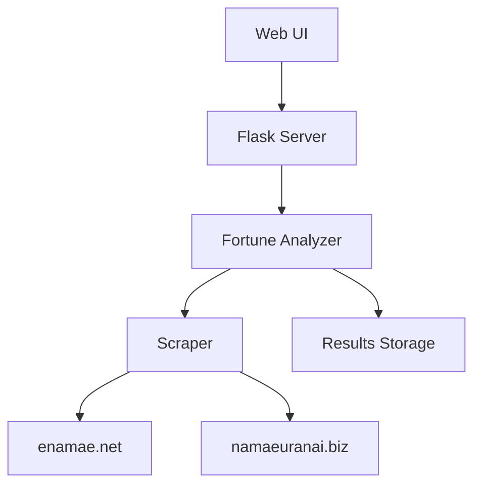

# 姓名判断アプリケーション仕様書

## 1. システム構成

### 1.1 アーキテクチャ


### 1.2 技術スタック
- フロントエンド：HTML, CSS, JavaScript
- バックエンド：Python 3.8+, Flask
- データベース：ファイルシステム（JSON）
- コンテナ化：Docker, docker-compose

## 2. 機能仕様

### 2.1 姓名判断機能
1. 入力項目
   - 姓（必須）
   - 名（必須）
   - 性別（必須、男性/女性）

2. 処理フロー
   ```mermaid
   sequenceDiagram
       participant U as User
       participant S as Server
       participant A as Analyzer
       participant W as Web Sites
       
       U->>S: 姓名・性別を入力
       S->>A: 運勢分析リクエスト
       A->>W: 各サイトにリクエスト
       W-->>A: 運勢結果
       A->>A: 結果の統合分析
       A-->>S: 統合結果
       S-->>U: 結果表示
   ```

3. 出力項目
   - 天格、人格、地格、外格、総格
   - 三才配置
   - 運勢スコア
   - 詳細な運勢解説

### 2.2 画数パターン分析機能
1. 入力項目
   - 姓（必須）
   - 文字数（1-3文字）

2. 処理フロー
   ```mermaid
   sequenceDiagram
       participant U as User
       participant S as Server
       participant A as Analyzer
       participant W as Web Sites
       
       U->>S: 姓・文字数を入力
       S->>A: 分析開始
       A->>A: パターン生成
       loop 各パターン
           A->>W: 運勢分析
           W-->>A: 結果
           A->>S: 進捗更新
           S->>U: 進捗表示
       end
       A->>A: 結果の保存
       A-->>S: 完了通知
       S-->>U: 結果表示
   ```

3. 出力項目
   - 進捗状況
   - 分析結果（JSON）
   - エラー情報（発生時）

## 3. データ仕様

### 3.1 運勢データ
```json
{
    "enamae": {
        "天格": "吉",
        "人格": "大吉",
        "地格": "吉",
        "外格": "凶",
        "総格": "吉",
        "三才配置": "吉"
    },
    "namaeuranai": {
        "天格": "大吉",
        "人格": "吉",
        "地格": "吉",
        "外格": "凶",
        "総格": "吉",
        "仕事運": "吉",
        "家庭運": "吉"
    }
}
```

### 3.2 分析結果データ
```json
{
    "generated_at": "2024-03-15T12:00:00",
    "last_name": "山田",
    "char_count": 2,
    "total_patterns": 400,
    "top_results": [
        {
            "strokes": [10, 5],
            "characters": "俺兄",
            "enamae_result": {...},
            "namaeuranai_result": {...},
            "total_score": 85.5
        }
    ]
}
```

## 4. エラー処理

### 4.1 エラー種別
1. 入力エラー
   - 必須項目の未入力
   - 不正な文字数
   - 不正な性別値

2. システムエラー
   - スクレイピング失敗
   - タイムアウト
   - ファイル保存エラー

### 4.2 エラーメッセージ
- 入力エラー：ユーザーに修正を促すメッセージ
- システムエラー：管理者に通知するエラーログ

## 5. セキュリティ仕様

### 5.1 入力値検証
- XSS対策
- SQLインジェクション対策
- パス操作対策

### 5.2 セッション管理
- セッションタイムアウト：30分
- セッションIDの再生成
- セキュアなクッキー設定

## 6. 将来の拡張予定

### 6.1 機能拡張
1. 名前生成機能
   - 姓と性別から最適な名前を提案
   - 画数パターンに基づく分析
   - 運勢スコアの計算と表示

2. データ管理機能
   - 結果の履歴管理
   - お気に入り機能
   - 結果の共有機能

### 6.2 技術的拡張
1. データベース導入
   - ユーザー管理
   - 結果の永続化
   - 履歴管理

2. パフォーマンス最適化
   - キャッシュ機能
   - 非同期処理の改善
   - バッチ処理の導入 