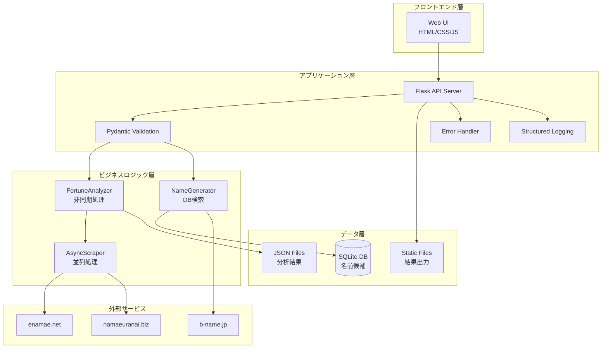
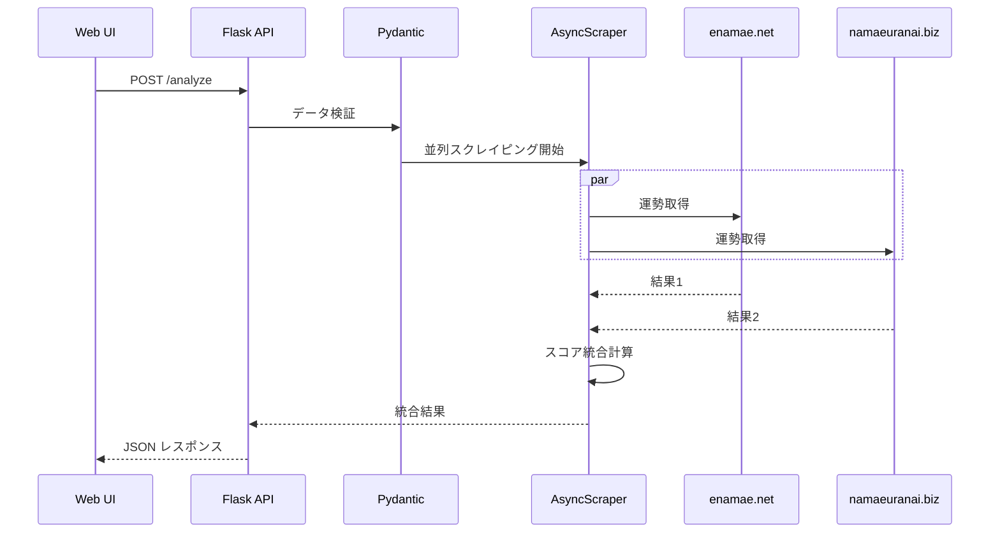

# 姓名判断アプリケーション技術仕様書

## 🏗️ システムアーキテクチャ

### 全体構成


### 技術スタック詳細
| 層 | 技術 | バージョン | 用途 |
|-----|------|------------|------|
| フロントエンド | HTML5/CSS3/ES6 | Latest | レスポンシブUI |
| Webフレームワーク | Flask | 2.3+ | 軽量API実装 |
| 言語 | Python | 3.8+ | 型ヒント対応 |
| バリデーション | Pydantic | 2.0+ | 型安全性保証 |
| 非同期処理 | asyncio | Built-in | I/O集約型最適化 |
| データベース | SQLite | 3.35+ | 軽量・組み込み |
| ログ | structlog | Latest | 構造化ログ |
| コンテナ | Docker/Compose | Latest | 環境統一 |

## 🔧 機能別技術仕様

### 姓名判断機能
**実装クラス**: `FortuneAnalyzer`
**エンドポイント**: `POST /analyze`

**入力バリデーション（Pydantic）**
```python
class FortuneRequest(BaseModel):
    last_name: str = Field(..., min_length=1, max_length=10)
    first_name: str = Field(..., min_length=1, max_length=10)
    gender: Literal['m', 'f'] = Field(..., description="性別")
```

**処理シーケンス**


**出力データ構造**
```json
{
  "enamae": {
    "天格": "大吉", "人格": "吉", "地格": "大吉",
    "外格": "凶", "総格": "吉", "三才配置": "吉"
  },
  "namaeuranai": {
    "天格": "大大吉", "人格": "吉", "地格": "大吉",
    "外格": "凶", "総格": "吉", "仕事運": "吉", "家庭運": "吉"
  },
  "total_score": 87.5
}
```

### 画数パターン分析機能
**実装クラス**: `FortuneAnalyzer` + `StrokePatternGenerator`
**エンドポイント**: `POST /analyze_strokes`, `GET /analyze_progress/<queue_id>`

**非同期処理設計**
```python
async def analyze(self, last_name: str, char_count: int):
    # セマフォで並列数制御（最大4並列）
    semaphore = asyncio.Semaphore(4)

    async def process_pattern(pattern):
        async with semaphore:
            await asyncio.sleep(0.5)  # レート制限
            return await asyncio.to_thread(
                self.scraper.get_fortune,
                last_name, name, "m", True
            )

    # 全パターンを並列実行
    tasks = [process_pattern(p) for p in patterns]
    results = await asyncio.gather(*tasks)
```

**進捗管理**
```python
# グローバル進捗辞書
analysis_progress = {
    "queue_id": {
        "progress": 45.5,     # 完了率%
        "status": "running",  # running/complete/error
        "pattern": [8, 13],   # 現在処理中パターン
        "results": {...}      # 完了時のみ
    }
}
```

### 名前候補生成機能
**実装クラス**: `NameGenerator`
**エンドポイント**: `GET /api/v1/name_candidates`

**データベース設計**
```sql
CREATE TABLE names (
    id INTEGER PRIMARY KEY AUTOINCREMENT,
    name TEXT NOT NULL,           -- 漢字名前
    yomi TEXT,                    -- 読み仮名
    chars INTEGER NOT NULL,       -- 文字数
    strokes_1 INTEGER NOT NULL,   -- 1文字目画数
    strokes_2 INTEGER,            -- 2文字目画数
    strokes_3 INTEGER,            -- 3文字目画数
    total_strokes INTEGER NOT NULL, -- 総画数
    gender TEXT NOT NULL,         -- 性別
    source_url TEXT,              -- 取得元URL
    scraped_at TIMESTAMP DEFAULT CURRENT_TIMESTAMP
);

-- パフォーマンス最適化用インデックス
CREATE INDEX idx_search ON names(chars, strokes_1, strokes_2, strokes_3, gender);
```

**動的スクレイピング（データ不足時）**
```python
def name_candidates_api():
    candidates = get_name_candidates(...)
    if not candidates:
        # バックグラウンドでスクレイピング実行
        job_id = start_background_scraping(...)
        return {"scraping": True, "job_id": job_id}, 202
    return {"candidates": candidates, "count": len(candidates)}
```

## 📊 データ仕様詳細

### エラーハンドリング設計
**Pydanticモデルによる型安全性**
```python
class ErrorResponse(BaseModel):
    error: str
    timestamp: datetime = Field(default_factory=datetime.now)
    request_id: Optional[str] = None

class FortuneResponse(BaseModel):
    enamae: Dict[str, str]
    namaeuranai: Dict[str, str]
    total_score: float = Field(ge=0, le=100)
    processing_time: float
```

**構造化ログ設計**
```python
import structlog

logger = structlog.get_logger(__name__)

# 使用例
logger.info("fortune_analysis_completed",
           last_name=last_name,
           first_name=first_name,
           total_score=score,
           processing_time=elapsed_time)
```

### キャッシュ戦略
```python
# 分析結果の永続化
def save_analysis_cache(last_name: str, char_count: int, results: dict):
    filename = f"static/results_{last_name}_{char_count}字.json"
    with open(filename, 'w', encoding='utf-8') as f:
        json.dump(results, f, ensure_ascii=False, indent=2)

# 名前候補のDB保存
def cache_name_candidates(candidates: List[Dict]):
    conn = sqlite3.connect(DB_PATH)
    for candidate in candidates:
        conn.execute("""
            INSERT OR IGNORE INTO names
            (name, yomi, chars, strokes_1, strokes_2, strokes_3,
             total_strokes, gender, source_url)
            VALUES (?, ?, ?, ?, ?, ?, ?, ?, ?)
        """, (candidate['name'], candidate['yomi'], ...))
    conn.commit()
```

## 🔒 セキュリティ・エラー処理

### 入力検証レイヤー
**レベル1: Pydanticバリデーション**
```python
class FortuneRequest(BaseModel):
    last_name: str = Field(..., min_length=1, max_length=10,
                          regex=r'^[ぁ-んァ-ヶ一-龯々]+$')
    first_name: str = Field(..., min_length=1, max_length=10,
                           regex=r'^[ぁ-んァ-ヶ一-龯々]+$')
    gender: Literal['m', 'f']
```

**レベル2: ビジネスロジック検証**
```python
def validate_stroke_pattern(chars: int, strokes: List[int]) -> bool:
    if len(strokes) != chars:
        return False
    if any(s < 1 or s > 30 for s in strokes):
        return False
    return True
```

### エラー分類とハンドリング
| エラータイプ | HTTPコード | 対応策 |
|--------------|------------|--------|
| バリデーションエラー | 400 | 詳細なエラーメッセージ |
| 外部サイト障害 | 503 | リトライ機構 |
| タイムアウト | 504 | 部分結果返却 |
| システムエラー | 500 | ログ出力・通知 |

**エラーレスポンス統一**
```python
@app.errorhandler(ValidationError)
def handle_validation_error(e):
    error_response = ErrorResponse(
        error=f"入力データが不正です: {str(e)}",
        request_id=request.headers.get('X-Request-ID')
    )
    return jsonify(error_response.model_dump()), 400
```

### レート制限・負荷制御
```python
# セマフォによる同時接続数制限
scraping_semaphore = asyncio.Semaphore(4)

# 外部サイトへのリクエスト間隔制御
async def rate_limited_request(url: str, delay: float = 0.5):
    async with scraping_semaphore:
        await asyncio.sleep(delay)
        return await make_request(url)
```

## 🌐 REST API仕様

### 統一レスポンス設計
**成功レスポンス**
```json
{
  "success": true,
  "data": { /* 実際のデータ */ },
  "timestamp": "2024-03-20T10:00:00+09:00",
  "processing_time": 0.125
}
```

**エラーレスポンス**
```json
{
  "success": false,
  "error": {
    "code": "VALIDATION_ERROR",
    "message": "入力データが不正です",
    "details": ["姓は必須項目です"]
  },
  "timestamp": "2024-03-20T10:00:00+09:00"
}
```

### エンドポイント一覧

#### 1. 姓名判断API
```http
POST /api/v1/analyze
Content-Type: application/json

{
  "last_name": "山田",
  "first_name": "太郎",
  "gender": "m"
}
```

**レスポンス例（200 OK）**
```json
{
  "success": true,
  "data": {
    "enamae": {
      "天格": "大吉", "人格": "吉", "地格": "大吉",
      "外格": "凶", "総格": "吉", "三才配置": "吉"
    },
    "namaeuranai": {
      "天格": "大大吉", "人格": "吉", "地格": "大吉",
      "外格": "凶", "総格": "吉", "仕事運": "大吉", "家庭運": "吉"
    },
    "scores": {
      "enamae_score": 86.7,
      "namaeuranai_score": 88.6,
      "total_score": 87.6
    }
  },
  "processing_time": 2.34
}
```

#### 2. 画数パターン分析API
```http
POST /api/v1/analyze_strokes
Content-Type: application/json

{
  "last_name": "田中",
  "char_count": 2
}
```

**レスポンス例（202 Accepted）**
```json
{
  "success": true,
  "data": {
    "queue_id": "田中_2_20240320100000",
    "estimated_time": 300,
    "total_patterns": 400
  }
}
```

#### 3. 分析進捗確認API
```http
GET /api/v1/analyze_progress/{queue_id}
```

**レスポンス例（200 OK）**
```json
{
  "success": true,
  "data": {
    "progress": 45.5,
    "status": "running",
    "current_pattern": [8, 13],
    "completed_patterns": 182,
    "total_patterns": 400,
    "estimated_remaining": 185
  }
}
```

#### 4. 名前候補生成API
```http
GET /api/v1/name_candidates?chars=2&strokes1=8&strokes2=13&gender=male
```

**レスポンス例（200 OK）**
```json
{
  "success": true,
  "data": {
    "candidates": [
      {
        "name": "佳樹",
        "yomi": "かずき",
        "gender": "male",
        "total_strokes": 21
      },
      {
        "name": "英資",
        "yomi": "えいし",
        "gender": "male",
        "total_strokes": 21
      }
    ],
    "count": 47,
    "search_criteria": {
      "chars": 2,
      "strokes": [8, 13],
      "gender": "male"
    }
  }
}
```

#### 5. ヘルスチェックAPI
```http
GET /healthz
```

**レスポンス例（200 OK）**
```json
{
  "status": "healthy",
  "timestamp": "2024-03-20T10:00:00+09:00",
  "version": "1.0.0",
  "dependencies": {
    "database": "connected",
    "external_sites": "reachable"
  }
}
```

### API認証・制限（将来拡張）
```http
# リクエストヘッダー例
Authorization: Bearer {api_token}
X-Request-ID: {unique_request_id}
X-Rate-Limit: 100
```
