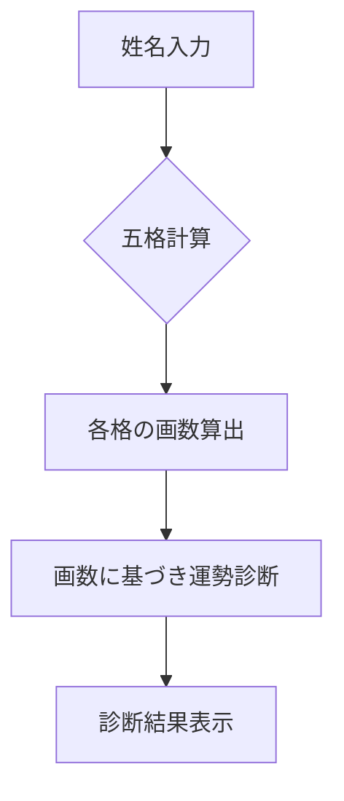
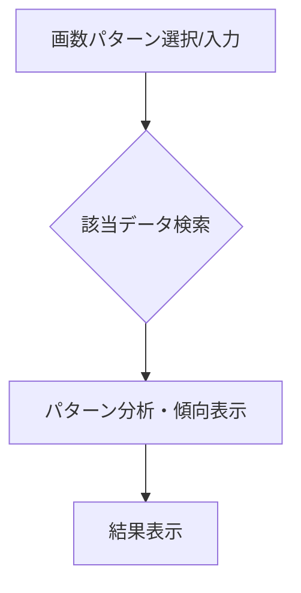

# 機能一覧

このドキュメントは、本アプリケーションが提供する機能の一覧とその概要を記載します。

## 1. 姓名判断アプリ

### 概要

入力された姓名の画数に基づき、五格（天格、人格、地格、外格、総格）を計算し、それぞれの運勢を診断します。

### フロー図



## 2. 画数パターン分析

### 概要

特定の画数の組み合わせを持つ名前のリストや、その画数パターンが持つ一般的な傾向などを分析・表示します。（※詳細仕様は `画数別運勢一覧機能仕様書.md` を参照）

### フロー図



## 3. 画数指定による名前候補生成 (New!)

### 概要

ユーザーが指定した文字数（1～3文字）、各文字の画数、および性別に基づき、「赤ちゃん命名ガイド」(https://b-name.jp/) からスクレイピングしたデータを元に、条件に合致する漢字の名前候補を最大50件提示します。

### フロー図

```mermaid
graph TD
    subgraph データ準備 (初回or定期的実行)
        S1[赤ちゃん命名ガイドからスクレイピング] --> S2[名前、画数、性別情報を抽出];
        S2 --> S3[SQLiteデータベースに保存];
    end

    subgraph ユーザー操作
        A[文字数、各文字の画数、性別を入力] --> B{データベース検索};
        B --> C[条件に合致する名前候補を抽出];
        C --> D[最大50件を表示];
    end
``` 