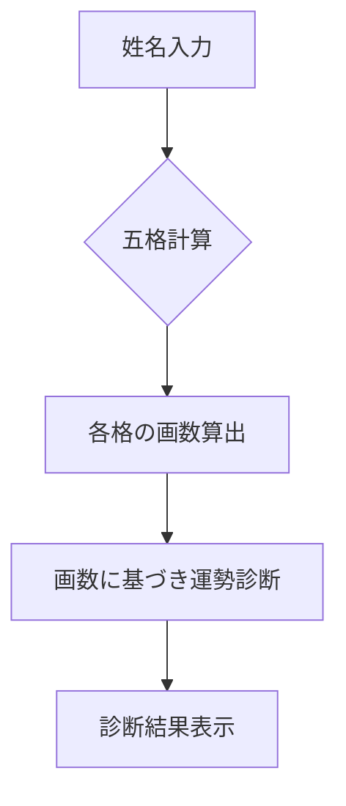
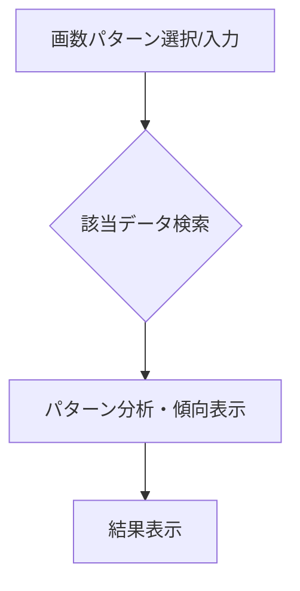
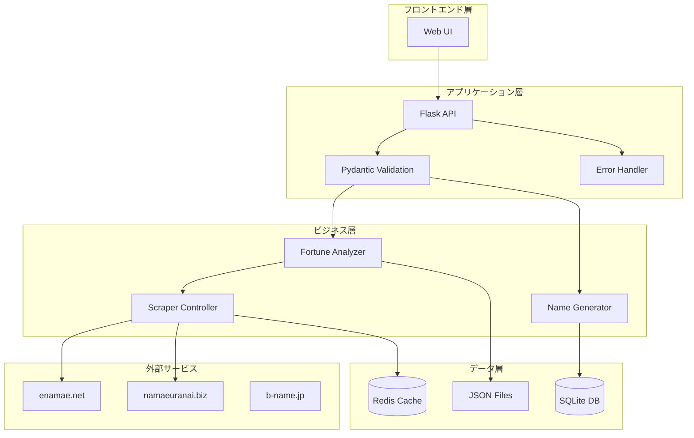

# 機能一覧

このドキュメントは、本アプリケーションが提供する機能の一覧とその概要を記載します。

## 1. 姓名判断アプリ

### 概要

入力された姓名の画数に基づき、五格（天格、人格、地格、外格、総格）を計算し、それぞれの運勢を診断します。

### フロー図



## 2. 画数パターン分析

### 概要

特定の画数の組み合わせを持つ名前のリストや、その画数パターンが持つ一般的な傾向などを分析・表示します。（※詳細仕様は `画数別運勢一覧機能仕様書.md` を参照）

### フロー図



## 3. 画数指定による名前候補生成 (New!)

### 概要

ユーザーが指定した文字数（1～3文字）、各文字の画数、および性別に基づき、「赤ちゃん命名ガイド」(https://b-name.jp/) からスクレイピングしたデータを元に、条件に合致する漢字の名前候補を最大50件提示します。

### フロー図

```mermaid
graph TD
    subgraph データ準備 (初回or定期的実行)
        S1[赤ちゃん命名ガイドからスクレイピング] --> S2[名前、画数、性別情報を抽出];
        S2 --> S3[SQLiteデータベースに保存];
    end

    subgraph ユーザー操作
        A[文字数、各文字の画数、性別を入力] --> B{データベース検索};
        B --> C[条件に合致する名前候補を抽出];
        C --> D[最大50件を表示];
    end
```

## 4. リファクタリング改善点 (New!)

### アーキテクチャ改善



### 品質向上機能

- **型安全性**: Pydanticモデルによる厳密な型チェック
- **構造化ログ**: structlogによる構造化ログ出力
- **設定管理**: 環境変数による設定の外部化
- **テスト**: pytest + coverage による包括的テスト
- **CI/CD**: GitHub Actions による自動テスト・デプロイ
- **コード品質**: Black, isort, flake8, mypy による品質管理
- **セキュリティ**: Bandit, Trivy による脆弱性スキャン
- **コンテナ**: マルチステージビルドによる最適化
- **監視**: ヘルスチェック、Redis キャッシュ統合

### パフォーマンス改善

- **非同期処理**: asyncio による並列処理最適化
- **キャッシュ**: Redis による結果キャッシュ
- **データベース**: インデックス最適化とクエリ改善
- **レート制限**: スクレイピング負荷の適切な制御 