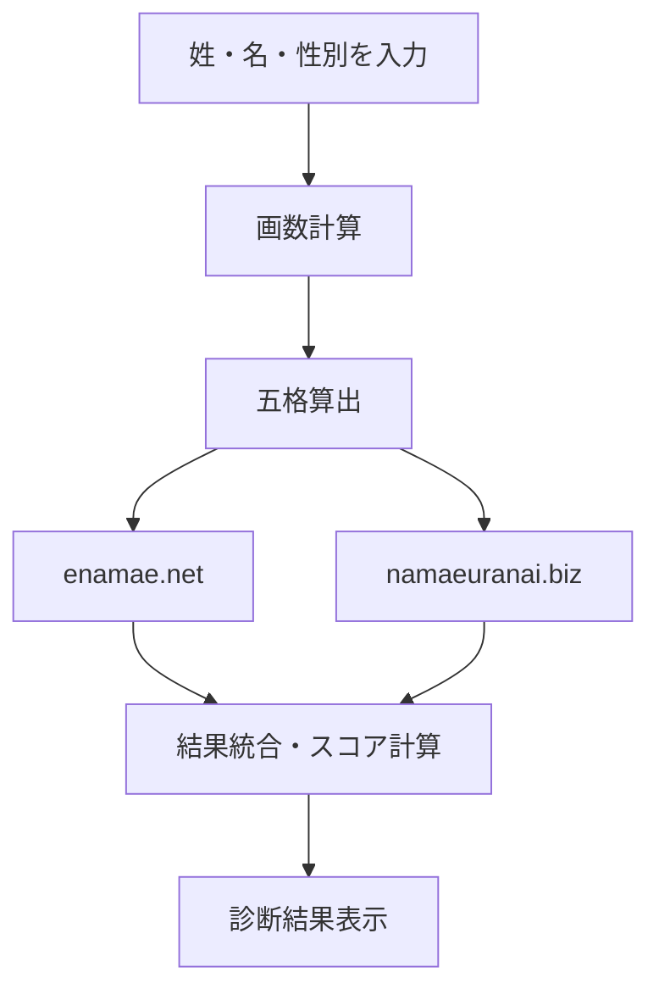
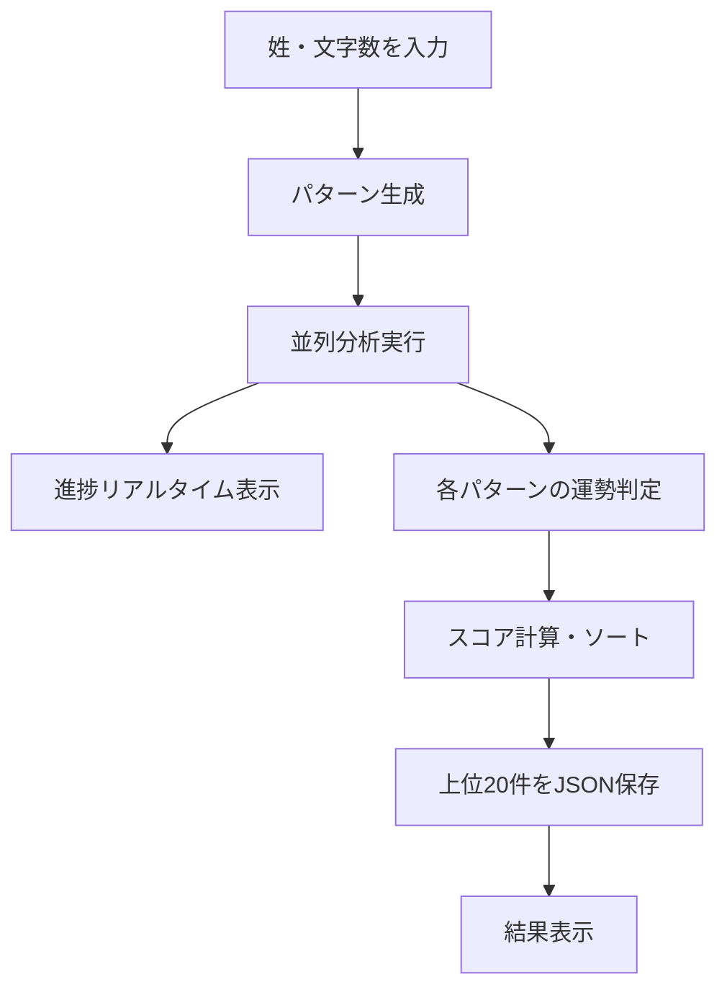
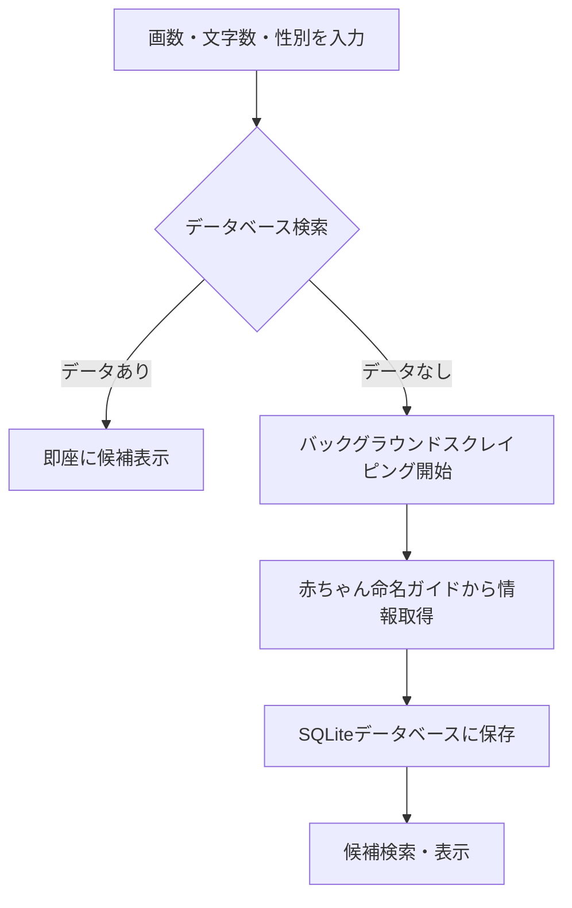

# 機能一覧

本アプリケーションが提供する3つの主要機能とその利用方法を説明します。

## 機能概要

| 機能名 | 目的 | 入力項目 | 出力結果 |
|--------|------|----------|----------|
| 姓名判断 | 特定の名前の運勢を判定 | 姓・名・性別 | 五格の運勢スコア |
| 画数パターン分析 | 最適な画数組み合わせを発見 | 姓・文字数 | 最適パターン上位20件 |
| 名前候補生成 | 画数条件に合う名前を検索 | 画数・性別 | 候補名前リスト（最大50件） |

## 1. 姓名判断機能

### 📋 概要
入力された姓名から五格（天格・人格・地格・外格・総格）を計算し、2つの姓名判断サイトの結果を統合して運勢スコアを算出します。

### 🔄 処理フロー

### 💯 スコア計算基準
**enamae.net**
- 大吉：100点 | 特殊格：90点 | 吉：80点 | 吉凶混合：60点 | 凶：40点 | 大凶：20点

**namaeuranai.biz**
- 大大吉：100点 | 大吉：90点 | 吉：80点 | 凶：40点 | 大凶：20点

**総合スコア = (enamae平均点 + namaeuranai平均点) ÷ 2**

## 2. 画数パターン分析機能

### 📋 概要
指定した文字数（1〜3文字）の全画数パターン（1〜20画）を網羅的に分析し、運勢スコアの高い組み合わせを発見します。

### 🔄 処理フロー

### ⏱️ 処理時間の目安
- 1文字：約30秒（20パターン）
- 2文字：約5分（400パターン）
- 3文字：約17分（8,000パターン）

### 📊 出力形式
- リアルタイム進捗表示
- JSON形式での結果保存（`static/results_姓_文字数字.json`）
- 運勢スコア順での上位20件表示

## 3. 名前候補生成機能

### 📋 概要
指定した画数・文字数・性別の条件に合致する実在の名前候補を検索します。データは「赤ちゃん命名ガイド」から収集されたものを使用します。

### 🔄 処理フロー

### 📋 入力条件
- **文字数**: 1〜3文字
- **画数**: 各文字の画数（1〜20画）
- **性別**: 男性・女性・指定なし

### 📊 出力結果
- 条件に合致する名前候補（漢字・読み・性別）
- 最大50件まで表示
- データがない場合は自動でスクレイピング実行

### ⚠️ 利用上の注意
- 初回検索時はスクレイピングにより時間がかかる場合があります
- データソースの利用規約を遵守し、適切な間隔でアクセスしています 