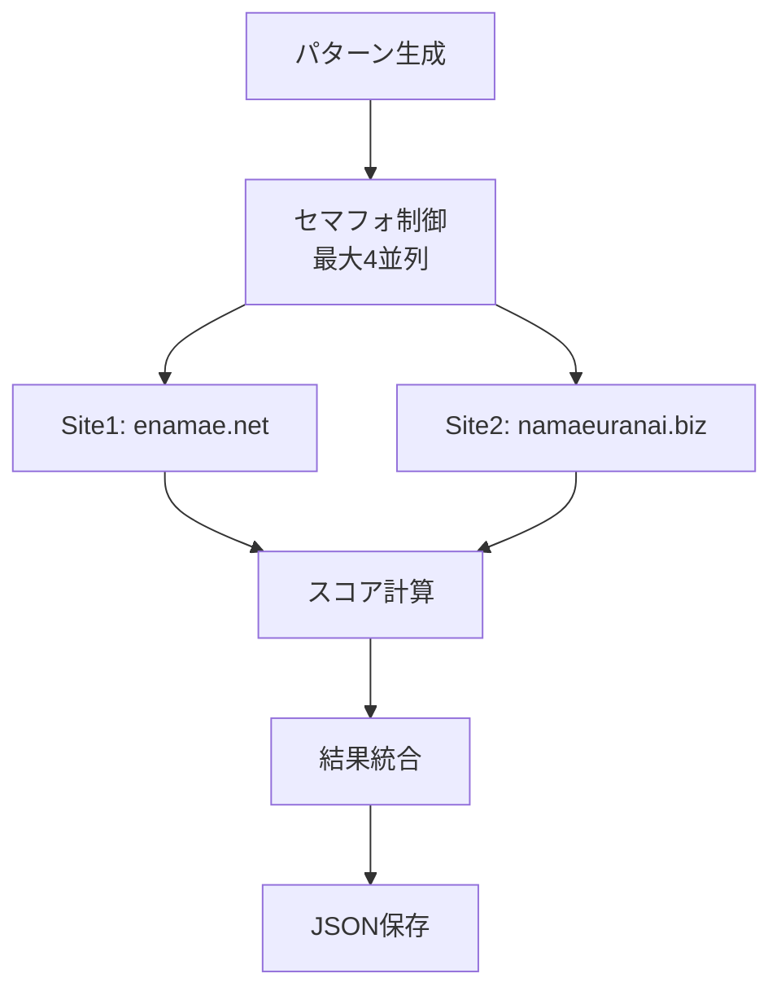
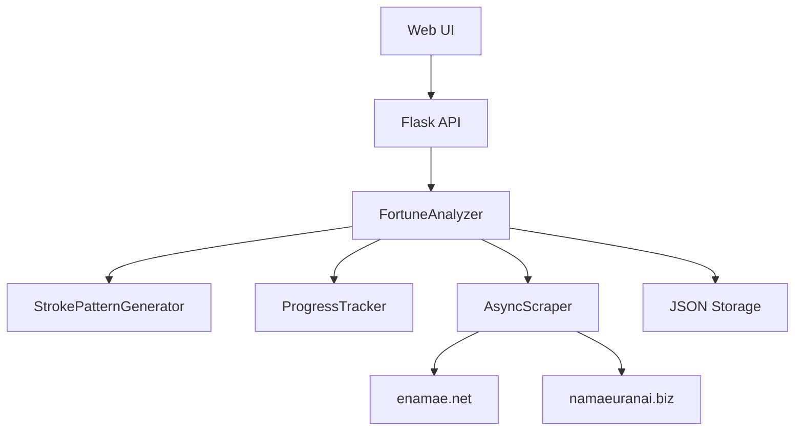

# 画数パターン分析機能仕様書

## 🎯 概要
指定した文字数の全画数パターンを網羅的に分析し、運勢スコアの高い組み合わせを発見する機能です。一度分析した結果は不変のため、結果を永続化して再利用します。

## 📊 分析スコープ
| 文字数 | パターン数 | 予想処理時間 | メモリ使用量 |
|--------|------------|--------------|--------------|
| 1文字 | 20パターン | 約30秒 | 軽微 |
| 2文字 | 400パターン | 約5分 | 中程度 |
| 3文字 | 8,000パターン | 約17分 | 高負荷 |

## 🔧 機能要件

### 画数分析処理の詳細
**入力パラメータ**
- 姓（必須）: 分析対象の姓
- 文字数（必須）: 1〜3文字

**処理アルゴリズム**
1. **パターン生成**: 指定文字数×画数（1-20）の全組み合わせ生成
2. **並列スクレイピング**: セマフォ制御（最大4並列）で負荷分散
3. **スコア統合**: 2サイトの結果を統一基準で数値化
4. **結果ソート**: 総合スコア降順で上位20件抽出

**並列処理設計**


### データ品質管理
**スクレイピング制御**
- **リクエスト間隔**: 0.5秒（サーバー負荷軽減）
- **エラーハンドリング**: 失敗時の自動リトライ
- **データ検証**: 取得結果の整合性チェック

**スコア計算基準**
| サイト | 判定 | スコア | 備考 |
|--------|------|--------|------|
| enamae | 大吉 | 100点 | 最高評価 |
| enamae | 特殊格 | 90点 | 特別パターン |
| enamae | 吉 | 80点 | 良好 |
| enamae | 吉凶混合 | 60点 | 中間 |
| enamae | 凶 | 40点 | 注意 |
| enamae | 大凶 | 20点 | 最低評価 |

| サイト | 判定 | スコア | 備考 |
|--------|------|--------|------|
| namaeuranai | 大大吉 | 100点 | 最高評価 |
| namaeuranai | 大吉 | 90点 | 優秀 |
| namaeuranai | 吉 | 80点 | 良好 |
| namaeuranai | 凶 | 40点 | 注意 |
| namaeuranai | 大凶 | 20点 | 最低評価 |

### ユーザーエクスペリエンス
**リアルタイム進捗表示**
- プログレスバー（完了率%表示）
- 現在処理中の画数パターン表示
- 推定残り時間の動的計算

**結果出力形式**
- **Web表示**: 上位20件をテーブル形式で表示
- **JSON保存**: `static/results_姓_文字数字.json` 形式
- **詳細情報**: 各パターンの詳細スコア内訳

## ⚡ 非機能要件

### パフォーマンス要件
| 項目 | 目標値 | 実装方法 |
|------|--------|----------|
| 3文字パターン分析 | 20分以内 | 並列処理（4並列） |
| 進捗更新頻度 | 1秒間隔 | 非同期コールバック |
| メモリ使用量 | 1GB以下 | ストリーミング処理 |
| UI応答性 | 即座 | バックグラウンド処理 |

### 可用性要件
- **エラー耐性**: 外部サイト障害時の適切な処理継続
- **リトライ機構**: 一時的な通信エラーの自動回復
- **進捗保存**: 処理中断時の再開機能

## 🖥️ システム設計

### アーキテクチャ概要


### 画面設計
**分析開始画面**
- 姓入力フィールド（必須）
- 文字数選択ラジオボタン（1/2/3文字）
- 分析開始ボタン

**進捗表示画面**
- 円形プログレスバー（完了率表示）
- 現在処理中パターン表示
- 推定残り時間表示
- キャンセルボタン

**結果表示画面**
- 上位20件結果テーブル
  - 順位 | 画数パターン | enamae結果 | namaeuranai結果 | 総合スコア
- JSONダウンロードボタン

## 📊 データ仕様

### 分析結果JSON構造
```json
{
  "generated_at": "2024-03-20T10:00:00+09:00",
  "last_name": "山田",
  "char_count": 2,
  "total_patterns": 400,
  "processing_time_seconds": 298,
  "top_results": [
    {
      "rank": 1,
      "strokes": [8, 13],
      "characters": "並働",
      "enamae_result": {
        "天格": "大吉",
        "人格": "大吉", 
        "地格": "大吉",
        "外格": "吉",
        "総格": "大吉",
        "三才配置": "吉"
      },
      "namaeuranai_result": {
        "天格": "大大吉",
        "人格": "大吉",
        "地格": "大大吉", 
        "外格": "吉",
        "総格": "大大吉",
        "仕事運": "大吉",
        "家庭運": "大吉"
      },
      "enamae_score": 93.3,
      "namaeuranai_score": 95.7,
      "total_score": 94.5
    }
  ]
}
```

### データベーススキーマ（将来拡張用）
```sql
-- 分析結果キャッシュテーブル
CREATE TABLE analysis_cache (
    id INTEGER PRIMARY KEY,
    last_name TEXT NOT NULL,
    char_count INTEGER NOT NULL,
    result_json TEXT NOT NULL,
    created_at TIMESTAMP DEFAULT CURRENT_TIMESTAMP,
    UNIQUE(last_name, char_count)
);
``` 