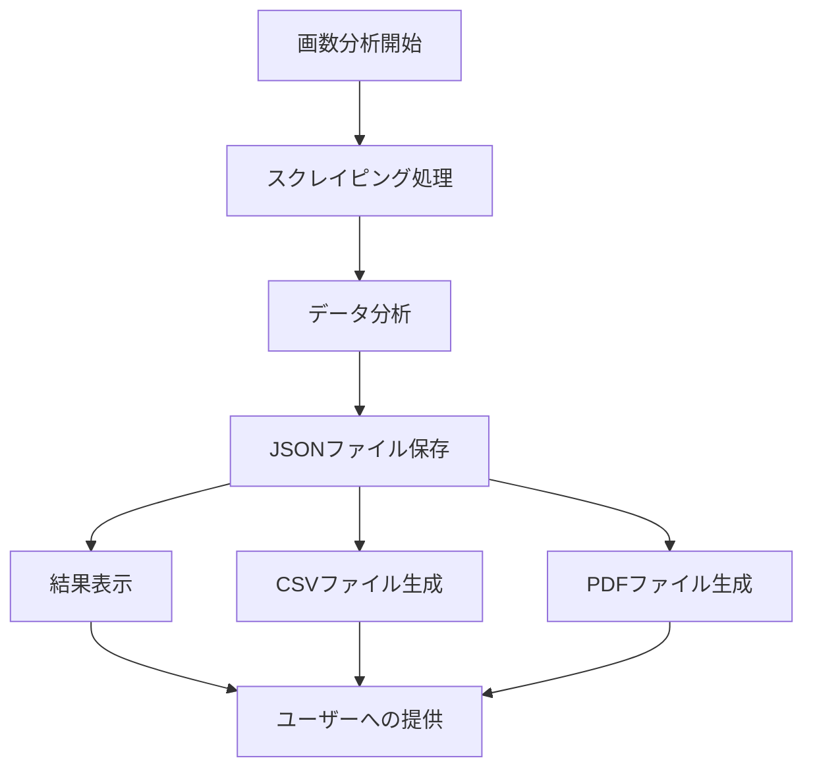

# 画数別運勢一覧機能仕様書

## 1. 概要
名前の画数組み合わせによる運勢分析を行い、最適な組み合わせを提示する機能。
画数の組み合わせによる運勢は不変のため、単発処理として実装する。

## 2. 機能要件

### 2.1 画数分析処理
- 1画から20画までの全組み合わせの運勢をスクレイピング
- 2つのサイト（enamae, namaeuranai）からデータを取得
- 結果をJSONファイルに保存
- スクレイピング詳細
  - リクエスト間隔: 0.5秒
  - 並列処理：
    - 2サイトを並列で処理
    - 画数組み合わせを4グループに分割して並列処理
  - 想定処理時間：約17分（3文字の場合）

### 2.2 データ分析
- 名前の文字数パターン（1文字、2文字、3文字）ごとに分析
- 各パターンで運勢総合スコアの上位10件を抽出
- 分析項目：
  - 画数の組み合わせ
  - サイトごとの運勢判定
    - enamae: 大吉、吉、凶、大凶、特殊格、吉凶混合
    - namaeuranai: 大大吉、大吉、吉、凶、大凶
  - 運勢スコア（各判定を点数化して合計）

### 2.3 ユーザーインターフェース
- 文字数パターンの選択機能（1文字、2文字、3文字）
- 処理進捗表示
  - プログレスバーによる進捗状況
  - 現在処理中の画数組み合わせ表示
- 結果表示
  - 処理完了後に画面に結果を表示
  - CSVダウンロード機能
  - PDFダウンロード機能

## 3. 非機能要件

### 3.1 性能要件
- スクレイピング処理：2時間以内に完了
- ダウンロードファイル生成：30秒以内
- 結果表示：ダウンロードファイル生成と同時に表示

## 4. システム構成



## 5. 画面仕様

### 5.1 メイン画面
- 文字数パターン選択（ラジオボタン）
- 実行ボタン
- プログレスバー
  - 全体の進捗率
  - 現在処理中の画数組み合わせ
- 結果表示エリア
  - テーブル形式で表示
  - 画数組み合わせ
  - 各サイトの判定結果
  - 総合スコア
- ダウンロードボタン（CSV, PDF）

## 6. データ構造

### 6.1 分析結果データ（JSON）
```json
{
  "generated_at": "2024-03-20T10:00:00",
  "patterns": {
    "one_character": [
      {
        "strokes": [5],
        "enamae_result": "大吉",
        "namaeuranai_result": "大大吉",
        "total_score": 95
      }
    ],
    "two_characters": [
      {
        "strokes": [5, 8],
        "enamae_result": "大吉",
        "namaeuranai_result": "大吉",
        "total_score": 95
      }
    ],
    "three_characters": [
      {
        "strokes": [5, 8, 10],
        "enamae_result": "大吉",
        "namaeuranai_result": "大大吉",
        "total_score": 95
      }
    ]
  }
}
```

### 6.2 スコア計算方式
- enamae
  - 大吉: 100点
  - 吉: 80点
  - 特殊格: 90点
  - 吉凶混合: 60点
  - 凶: 40点
  - 大凶: 20点
- namaeuranai
  - 大大吉: 100点
  - 大吉: 90点
  - 吉: 80点
  - 凶: 40点
  - 大凶: 20点

総合スコア = (enamaeスコア + namaeuranaiスコア) ÷ 2 