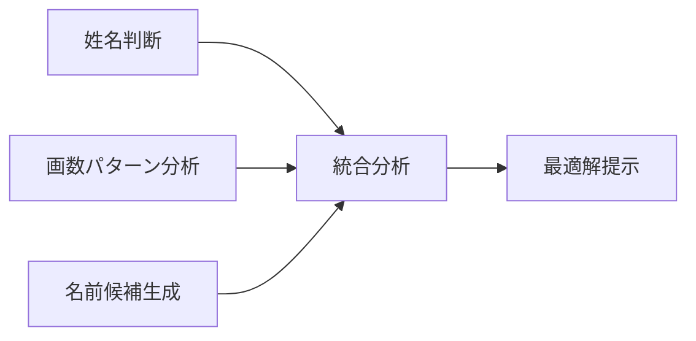

# 姓名判断アプリケーション要件定義書

## 🎯 プロジェクト概要

### 目的
複数の姓名判断サイトのデータを統合分析し、ユーザーに包括的な姓名判断サービスを提供する

### 解決する課題
- **手動分析の非効率性**: 複数サイトを個別にチェックする手間
- **最適解の発見困難**: 画数パターン全体の中での最適解特定
- **名前候補不足**: 特定の画数条件に合う実在名前の検索困難

### 対象ユーザー
| ユーザー種別 | 利用シーン | 主な要求 |
|--------------|------------|----------|
| 出産予定の親 | 子供の名前検討 | 運勢の良い名前候補の発見 |
| 姓名判断愛好者 | 趣味・興味 | 詳細な分析結果と根拠 |
| 研究者・専門家 | 統計分析・研究 | 大量データの一括処理 |

## 📋 機能要件

### 核心機能

### 機能詳細

#### 1. 姓名判断機能
**目的**: 特定の姓名の運勢を多角的に評価
- **入力**: 姓・名・性別
- **処理**: 2サイト並列スクレイピング + スコア統合
- **出力**: 五格別運勢 + 統合スコア（0-100点）

#### 2. 画数パターン分析機能
**目的**: 最適な画数組み合わせの網羅的発見
- **入力**: 姓・文字数（1-3字）
- **処理**: 全パターン並列分析（最大8,000パターン）
- **出力**: 上位20件 + 進捗可視化

#### 3. 名前候補生成機能
**目的**: 画数条件に合致する実在名前の提供
- **入力**: 画数・文字数・性別
- **処理**: SQLiteDB検索 + 必要時スクレイピング
- **出力**: 名前候補リスト（最大50件）

## ⚡ 非機能要件

### 性能要件
| 項目 | 目標値 | 根拠 |
|------|--------|------|
| 姓名判断レスポンス | 10秒以内 | 2サイト並列処理 |
| 画数分析（3文字） | 20分以内 | 8,000パターン処理 |
| 名前候補検索 | 3秒以内 | DB検索最適化 |
| 同時接続数 | 50ユーザー | 想定利用規模 |

### 可用性要件
- **サービス稼働率**: 99%以上
- **エラーハンドリング**: 外部サイト障害時の適切な通知
- **ログ記録**: 全操作の構造化ログ保存

## 🔒 制約条件

### 技術的制約
- **言語**: Python 3.8+ (型ヒント対応)
- **フレームワーク**: Flask (軽量・拡張性)
- **並行処理**: asyncio (I/O集約型処理最適化)
- **コンテナ**: Docker (環境統一・デプロイ簡素化)

### 外部連携制約
| サイト | 制約内容 | 対応策 |
|--------|----------|--------|
| enamae.net | リクエスト間隔 | 0.5秒ウェイト |
| namaeuranai.biz | 同時接続数制限 | セマフォ制御 |
| 赤ちゃん命名ガイド | サーバー負荷配慮 | 適切な待機時間設定 |

### 法的・倫理的制約
- **利用規約遵守**: 各サイトの規約に基づく適切なアクセス
- **データ利用範囲**: 個人利用に限定（再配布・商用利用禁止）
- **プライバシー保護**: 個人情報の適切な取扱い
